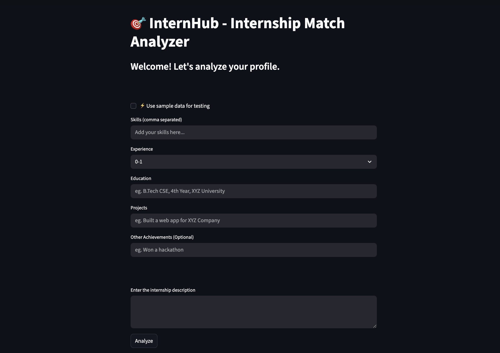

# 🎯 InternHub – AI Internship Match Analyzer

This project is a part of internship assignment by Kadeep.ai. 
InternHub is a simple AI-powered tool that helps students analyze how well their profile matches an internship description. It provides a match summary, identifies skill gaps, gives improvement suggestions, and generates an ATS-style confidence score.


### 🚀 Live Demo

[](https://internmatch-profile.streamlit.app/)


---


## 🚀 Features

- Manual profile input (skills, experience, education, projects, etc.)

- One-click Sample Data Mode for testing

- AI-powered profile vs internship matching

- Skill gap analysis

- Resume improvement suggestions

- ATS-style confidence score

- Clean and simple UI




--- 


## 🧪 Sample Mode

The system features a Sample Mode for quick demo

Click “Use sample data for testing” to auto-fill example inputs and instantly test the app.


---


## 📦 Tech Stack

- Python

- Streamlit

- LangChain

- Model = openai/gpt-oss-120b (via Groq)


---


## 🧠 How It Works

- User enters their profile OR uses sample data

- User pastes the internship description

- The AI model analyzes both inputs

- The system generates:

    - Match Summary
    - Skill Gap Analysis
    - Recommendations
    - Resume Suggestions
    - Confidence Score (0–100)


---


## ⚙️ Installation

```bash
git clone https://github.com/SarthakSharma2004/internhub.git
```

#### Install dependencies:

```bash
pip install -r requirements.txt
```

#### Make .env file:

```bash
GROQ_API_KEY = <Your-api-key>
```

#### Run the App

```bash
streamlit run app.py
```


---


## ⚠️ Disclaimer

This tool provides AI-generated insights and should be used for guidance only. It does not guarantee internship selection.

